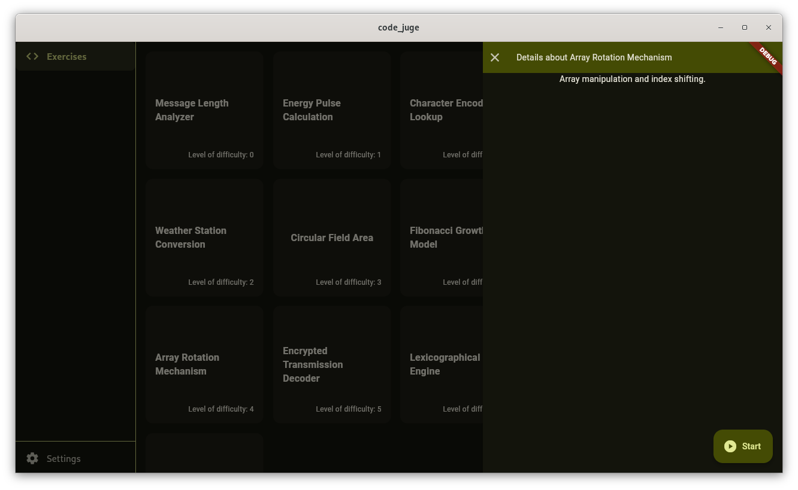
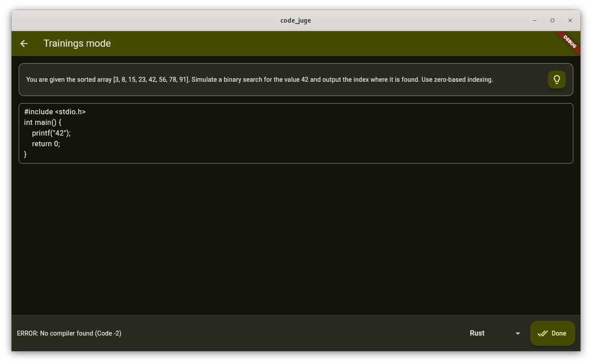
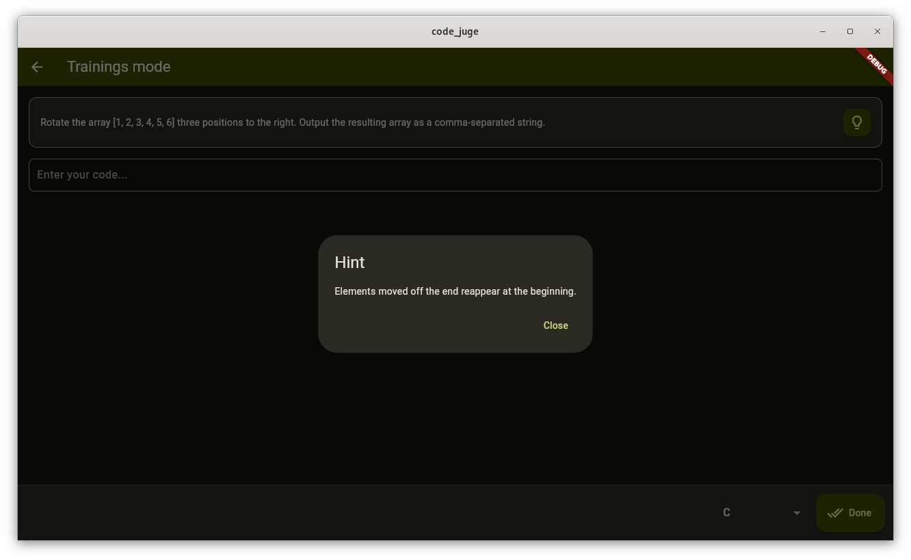
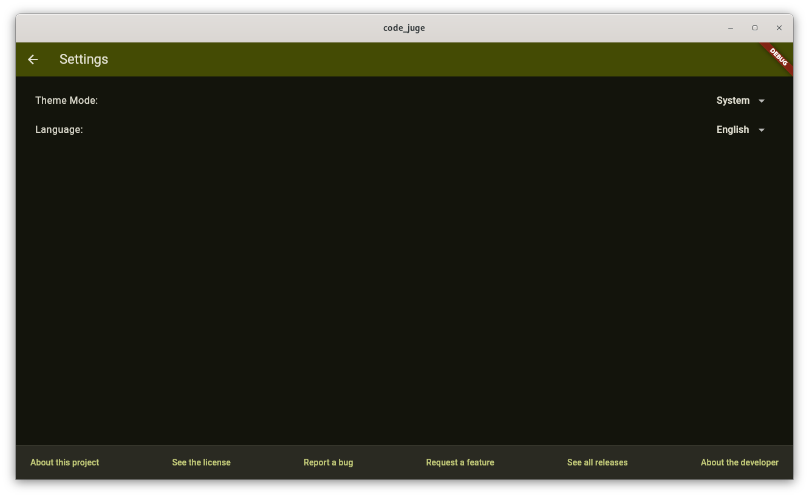

# CodeJudge: v.1.0.0 - Lambda
A simple, exam‑style code judge built with Flutter and a native C backend to help students practice and validate their programming logic.

## Tech Stack
- **Native C backend:** code evaluation • compilation • output comparison
- **Flutter (Dart):** UI • theming • localization • navigation

## Overview
- [Purpose & Benefits](#Purpose-&-Benefits)
- [Features](#Features)
- [Installation & Support](#Installation-&-Support)
- [Contribution-Guidelines](#Contribution-Guidelines)
  - *[Getting Started](#Getting-Started)*
  - *[Code Structure](#Code-Structure)*
  - *[Code Of Conduct](#Code-Of-Conduct)*
  - *[Attribution](#Attribution)*
- [Contact](#Contact)
- [Legal & Privacy](#Legal-&-Privacy)
  - *[License](#License)*
  - *[Legal & Transparency Statement](#Legal-&-Transparency-Statement)*
  - *[Third-Party Assets](#Third-Party-Assets)*
  - *[Data Usage Notice](#Data-Usage-Notice)*
  - *[Security Notice](#Security-Notice)*
  - *[Disclaimer](#Disclaimer)*
- [Screenshots](#Screenshots)

## Purpose & Benefits
CodeJudge is designed to help computer science students practice and prepare for their programming exams. It combines a modern Flutter UI with a high‑performance 
native C backend to simulate real exam conditions — without syntax highlighting, auto‑completion, or other IDE helpers. While it might help you to improve your 
skills, **there is no guarantee that it will improve your skills or grades**.
All your code is stored locally on your device—**your data remains private and is never shared** by this app.

## Features
### Main Features
- 10+ interesting exercises for your preparation
- Exercises of varying difficulty
- Training mode without any helpers
- Fast and deterministic evaluation powered by a native C backend
- Basic error messages by the backend
- 8 supported languages: C, Go, Python, C++, Rust, Ruby, JavaScript, PHP

### Further Features
- Light & dark mode support
- Material You‑inspired design
- English & German translation
- Responsive UI for all screen sizes

## Installation & Support
In order to use this app you need to install it and you need to make sure the compiler and interpreter by the programming languages you want to use is installed.
You don't need to install e.g. a compiler for C if you don't want to use C, but you need to have a compiler for e.g. Go installed if you use Go.
If the compiler misses, the C backend returns the error "No compiler found (Code -2)".

### Install on Linux
1. Make sure the compilers/interpreters for the languages you want to use are installed.
2. Download the .zip or .tar.xz file from the [latest Release](../../releases/latest)
3. Extract the archive
4. Now you can move the folder wherever you want to keep this app
5. Open the file CodeJudge.desktop in a text editor and adjust the following lines:
      > Exec=PATH/TO/THE/UNZIPED/RELEASE/CodeJudge
      > Icon=PATH/TO/THE/UNZIPED/RELEASE/app_icon.png
   Replace PATH/TO/THE/UNZIPED/RELEASE/ with the actual folder path where you placed the app.
6. Move the edited CodeJudge.desktop file to the following folder:
      > ~/.local/share/applications
7. Make the .desktop file executable by running this CMD command:
      ```bash
      chmod +x ~/.local/share/applications/CodeJudge.desktop
      ```
8. You can now launch CodeJudge from your application menu.

*You don't need to install all compilers and all interpreters, because they are just called when you select the programming languge in the training mode. It's allways possible to use the other languages too, by installing their compilers.*

## Contribution Guidelines
Everyone is welcome to participate in and adapt this project. All contributions and usage are governed by the [Apache 2.0 License](LICENSE).
Please see also [CONTRIBUTING.md](CONTRIBUTING.md) for guidelines.

### Getting Started
Clone the repository:
```bash
git clone https://github.com/naibaf-1/CodeJudge.git
```
### Architecture Overview
CodeJudge consists of two tightly integrated components:

1. **Flutter Frontend (Dart)**  
   - User interface 
   - Training mode
   - Localization & theming
   - Exercises

2. **Native C Backend**  
   - Compiles and executes user code
   - Compares output with expected results  
   - Returns deterministic responses  

### Code Structure
- `/lib` — Flutter UI (Dart)
- `/native` — CodeJudge engine (C)

### Code Of Conduct
Please note that this project adheres to a [Code of Conduct](CODE_OF_CONDUCT.md).  
By participating, you are expected to uphold this code.

### Attribution
If you fork and redistribute CodeJudge, please include the following attribution in your documentation:
> Based on CodeJudge by Fabian Roland (naibaf-1)

## Contact
You can contact me through GitHub—open an [issue](../../issues) or submit a pull request.

## Legal & Privacy
### License
This project is licensed under the [Apache License 2.0](LICENSE). Please respect my [NOTICE.md](NOTICE) as well.

### Legal & Transparency Statement
For details regarding data usage, third-party content, and security practices, please refer to this README.  
This document is intended to provide full transparency for users and complies with the requirements of the Apache License 2.0 and relevant privacy standards.

*If this app is distributed via an app store, the store description may refer to this README for further information.*

### Third-Party Assets
This app uses icons from the [Material Icons Library](https://fonts.google.com/icons) by Google, licensed under the [Apache License 2.0](https://www.apache.org/licenses/LICENSE-2.0).
© Google. Licensed under the Apache License, Version 2.0.

### Data Usage Notice
This app stores the code entered by the user locally on the device to process the user’s code and compare it with the solution. CodeJudge performs all evaluation 
locally on your device. No code is uploaded or transmitted to any server. All stored data is anonymous and used solely for functionality within the app.

### Security Notice
This app generates a file containing the code entered by the user. This file is necessary for the whole backend and it's overwritten as soon as the user enters 
code using the same programming language. While no personal data is collected or transmitted, users should be aware that unencrypted data may be accessible to 
other apps on the same device. To mitigate this risk, we recommend using devices with secure storage and keeping your system up to date. All data remains local 
and anonymous.

### Disclaimer
This app was developed to help computer science students preparing for their exams written on paper or at least without helpers like syntax highlighting. This 
means that CodeJudge intentionally provides no helpers such as syntax highlighting or auto‑completion. Since this app depends on good exercises, feel free to add 
or improve exercises!

## Screenshots
| <br>**See all exercises**| <br>**See details**|
|-------------------------------------------------------------------------------------|------------------------------------------------------------------------------------------|
|  <br><div align="center">**Train your skills**</div> |  <br><div align="center">**See hints**</div> |
|  <br><div align="center">**Toggle the settings**</div> |
